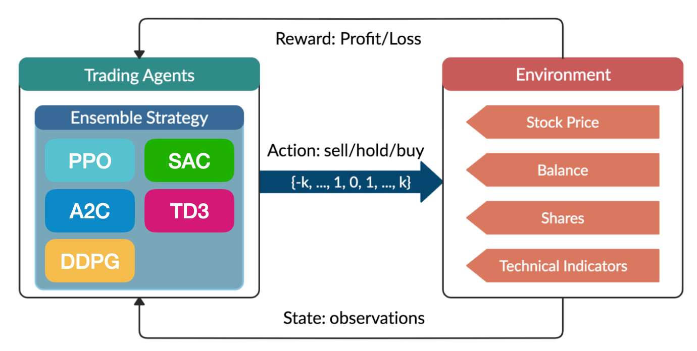

# Finance Optimal Execution & Deep RL Project

<!-- Project illustration (add your image to the repo and update the path below) -->

  

This project explores optimal execution of portfolio transactions using the Almgren-Chriss model and modern deep reinforcement learning (DRL) methods.

## Contents

- **Jupyter Notebooks**: Step-by-step explanations and experiments on optimal liquidation, trading lists, efficient frontier, and DRL approaches.
- **Python Modules**: Custom environments and agent implementations for multi-agent and single-agent RL.
- **Experiments**: Scripts for training and evaluating DDPG, SAC, TD3, PPO agents, and comparison with analytical solutions.
- **Results**: Scripts and code for plotting and analyzing experiment results.

## Main Folders & Files

- `finance/`  
  - `*.ipynb` — Notebooks for theory, simulation, and DRL experiments.
  - `MultiAgent_simulation/` — Multi-agent RL environment and training scripts.
  - `syntheticChrissAlmgren.py` — Almgren-Chriss simulation environment.
  - `ddpg_agent.py`, `sac_agent.py`, `td3_agent.py`, `ppo_agent.py` — RL agent implementations.
  - `train.py`, `run_experiments.py`, `optimize.py` — Training and experiment scripts.
  - `utils.py` — Helper functions for experiments and plotting.
  - Training results for each RL agent can be accessed in the `4-DRL.ipynb` notebook.

## Project Highlights

- Almgren-Chriss optimal execution model.
- Efficient frontier visualization.
- Deep RL agents (DDPG, SAC, TD3, PPO) for optimal trading.
- Multi-agent market simulation.
- Experiment tracking and result analysis.

## License

MIT License

---
